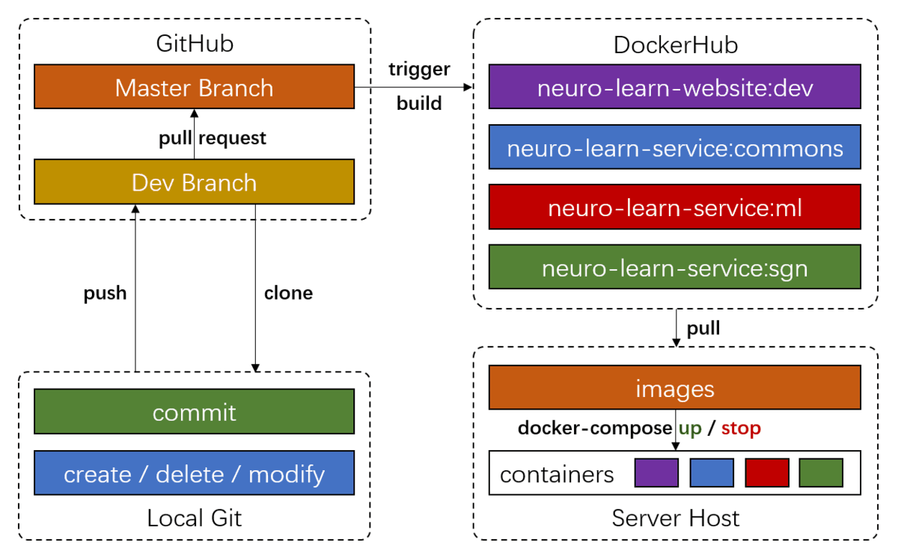

# NEURO-LEARN-DOCKER

Before you start, feel free to read our [article](https://www.jianshu.com/p/06f0451463fe) about NLD! :-)

## Quick Start

### Fast Deployment

```bash
# In the case of standalone deployment, the following ips are the same
# which is the ip of the deployed host
root@machine:/$ echo "{host ip for commons-service} commons.neurolearn.com" >> /etc/host
root@machine:/$ echo "{host ip for ml-service} ml.neurolearn.com" >> /etc/host
root@machine:/$ echo "{host ip for sgn-service} sgn.neurolearn.com" >> /etc/host
root@machine:/$ echo "{host ip for db-server} db.neurolearn.com" >> /etc/host
# Open a terminal on the host, change directory to NEURO-LEARN-DOCKER/utils
user@machine:~/NEURO-LEARN-DOCKER/utils$ docker-compose -f docker-compose.yml up -d
# To stop the containers
user@machine:~/NEURO-LEARN-DOCKER/utils$ docker-compose stop
```

> NOTE that NEURO-LEARN-DOCKER requires a deployed MySQL database server with corresponding tables.
> Starting fresh, one needs to follow the instructions mentioned in [wiki](https://github.com/Raniac/NEURO-LEARN-DOCKER/wiki) to initiate the database.

### Client Configuration

```bash
# Configure the ip for commons-service apis
root@machine:/$ echo "120.79.49.129 commons.neurolearn.com" >> /etc/host
# open a browser and type the address '120.79.49.129'
# VOILA!
```

## NLD Microservices Layout


## NLD DevOps Solution



## More

- More information about NEURO-LEARN-DOCKER can be found in [NLD Documentation](https://github.com/Raniac/NEURO-LEARN-DOCKER/wiki).
- 中文文档请戳[这里](https://www.jianshu.com/p/067747c881ee)。
