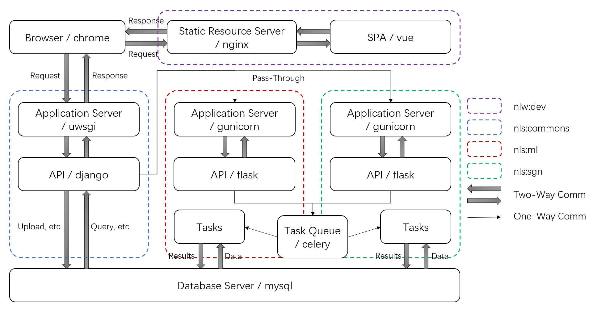

# NEURO-LEARN-DOCKER

Before you start, feel free to read our [article](https://www.jianshu.com/p/06f0451463fe) about NLD! :-)

## Quick Start

```bash
# Open a terminal on the host, change directory to utils
user@machine:~/NEURO-LEARN-DOCKER/utils$ docker-compose -f docker-compose.yml up -d
root@machine:/$ echo "120.79.49.129 commons.neurolearn.com" >> /etc/host
# open a browser and type the address '120.79.49.129'
# VOILA!
```

## NEURO-LEARN-DOCKER Layout



## More

- More information about NEURO-LEARN-DOCKER can be found in [NLD Documentation](https://github.com/Raniac/NEURO-LEARN-DOCKER/wiki).
- 中文文档请戳[这里](https://www.jianshu.com/p/067747c881ee)。
