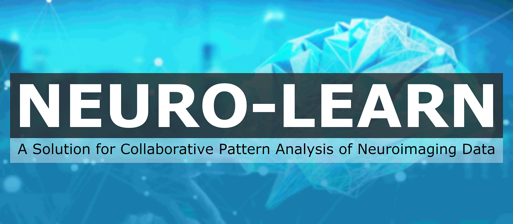

# NEURO-LEARN-DOCKER

**Before you start, feel free to read our [article](https://www.jianshu.com/p/06f0451463fe) about NLD! :-)**

## Quick Start

> 中文使用文档详见[Getting Started with NEURO-LEARN](https://www.jianshu.com/p/067747c881ee).

### Fast Deployment

```bash
# In the case of standalone deployment, the following ips are the same
# which is the ip of the deployed host
root@machine:/$ echo "{host ip for ml-service} ml.neurolearn.com" >> /etc/hosts
root@machine:/$ echo "{host ip for sa-service} sa.neurolearn.com" >> /etc/hosts
root@machine:/$ echo "{host ip for sgn-service} sgn.neurolearn.com" >> /etc/hosts
root@machine:/$ echo "{host ip for db-server} db.neurolearn.com" >> /etc/hosts
root@machine:/$ echo "{host ip for hdfs-master} hdfs.neurolearn.com" >> /etc/hosts
# Open a terminal on the host, change directory to NEURO-LEARN-DOCKER/utils
user@machine:~/NEURO-LEARN-DOCKER/utils$ docker-compose up -d
# To stop the containers
user@machine:~/NEURO-LEARN-DOCKER/utils$ docker-compose down
```

> NOTE that NEURO-LEARN-DOCKER requires a deployed MySQL database server with corresponding tables.
> Starting fresh, one needs to follow the instructions mentioned in [wiki](https://github.com/Raniac/NEURO-LEARN-DOCKER/wiki) to initiate the database.

### Client Configuration

```bash
# Configure the ip for api-service apis
root@machine:/$ echo "120.79.49.129 api.neurolearn.com" >> /etc/hosts
# Remember to configure the security options to allow insecure mixed contents
# Now open a browser and type the address https://raniac.github.io/neuro-learn-website/
# VOILA!
```

## NLD Microservices Framework

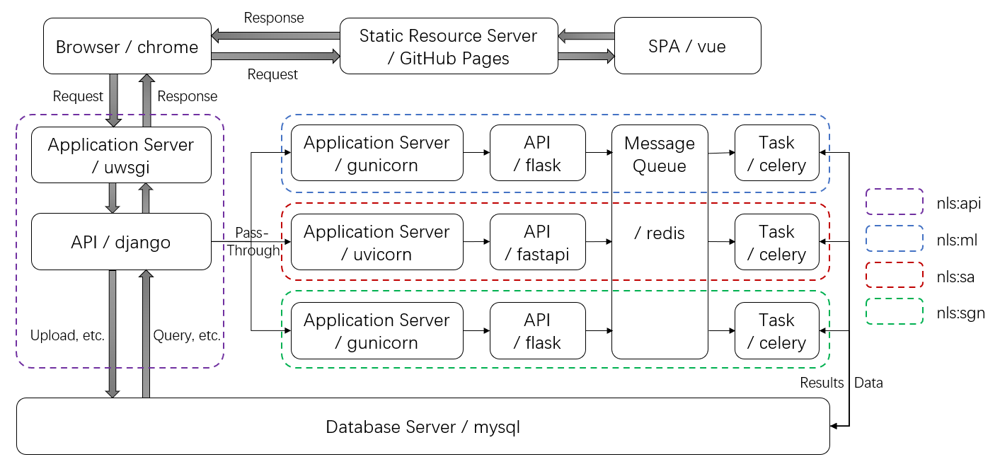

## NLD Continuous Integration

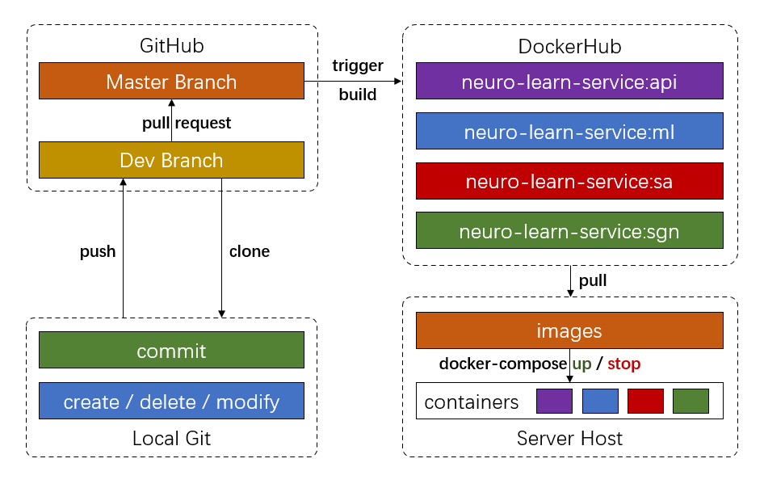

## NLD Website UI

> 中文文档详见[Getting Started with NEURO-LEARN](https://www.jianshu.com/p/067747c881ee)。

### Home

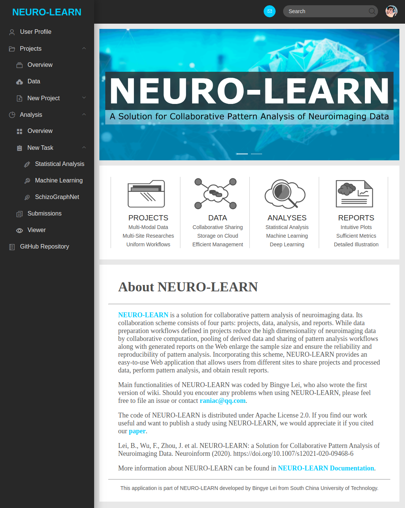

### Login

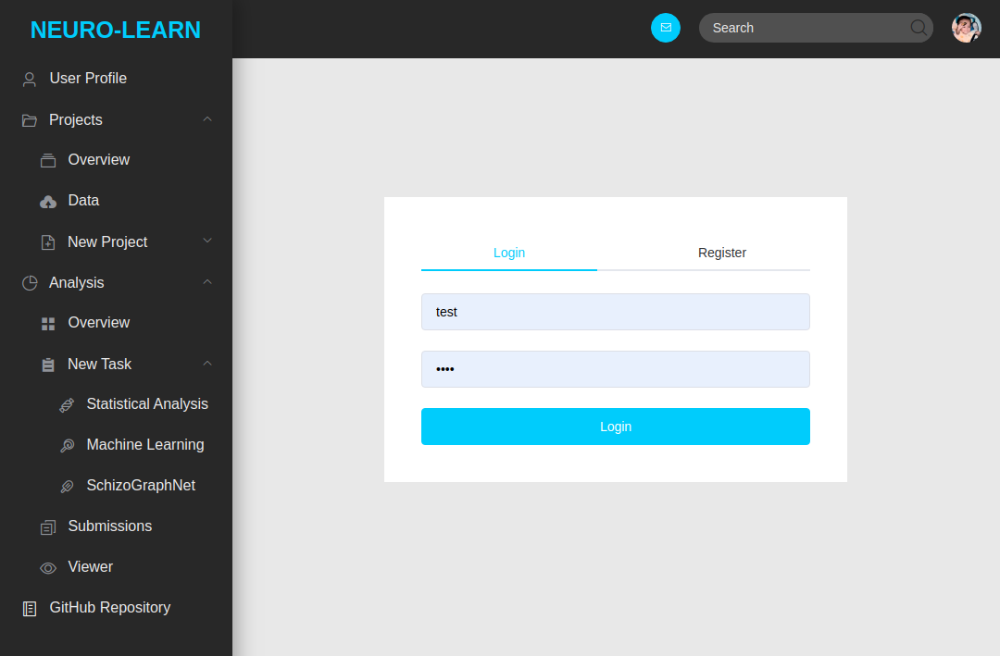

### Profile

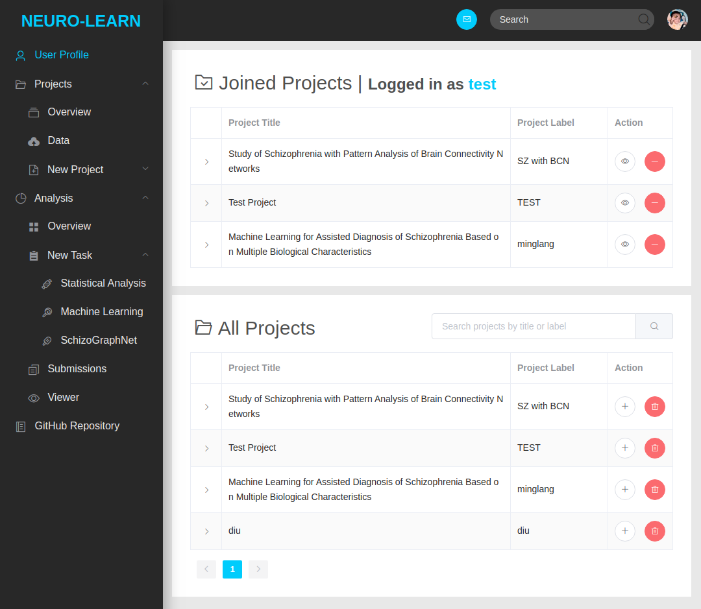

### Projects Overview

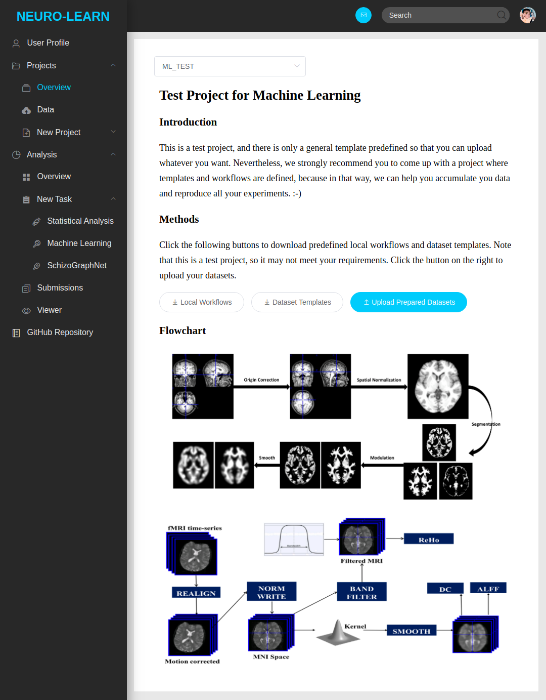

### Projects Data

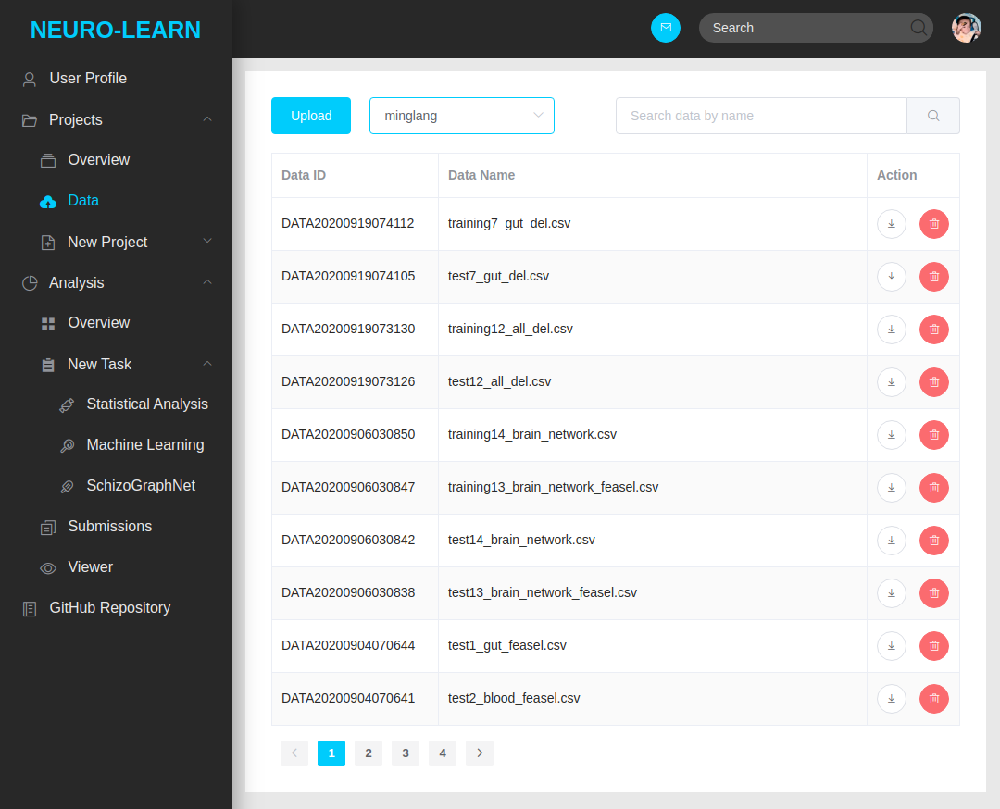

### New Projects


### New ML Task


### New SA-DA Task


### New SA-CA Task

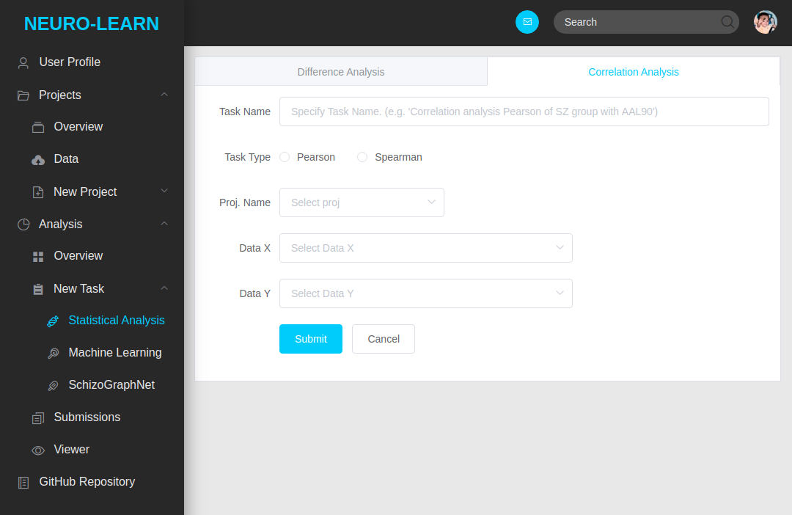

### New SGN Task

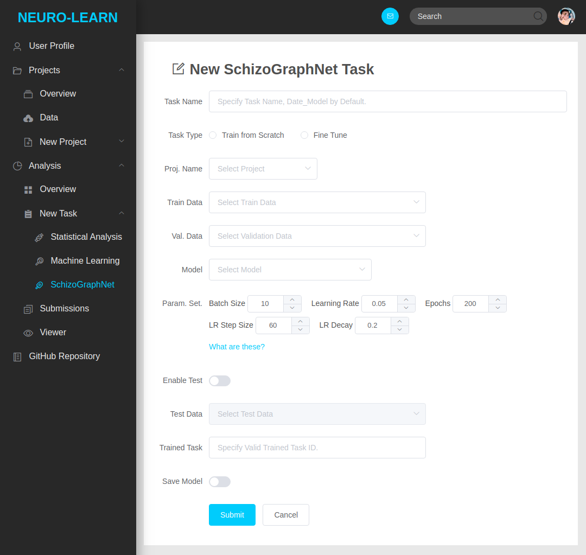

### Analysis Overview

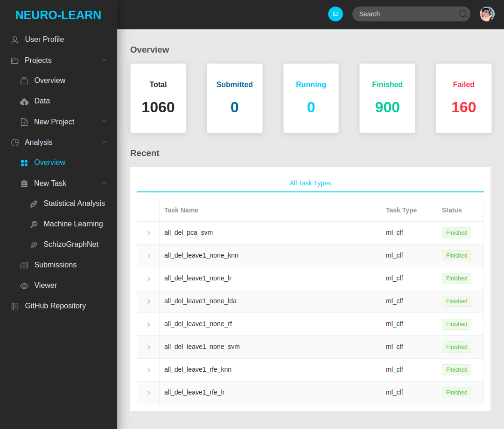

### Analysis Submissions

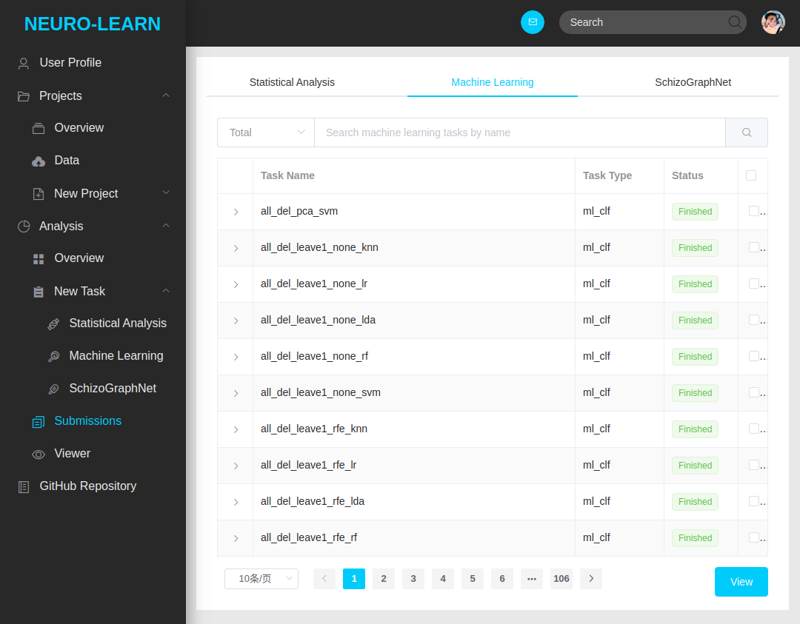

### Analysis Viewer

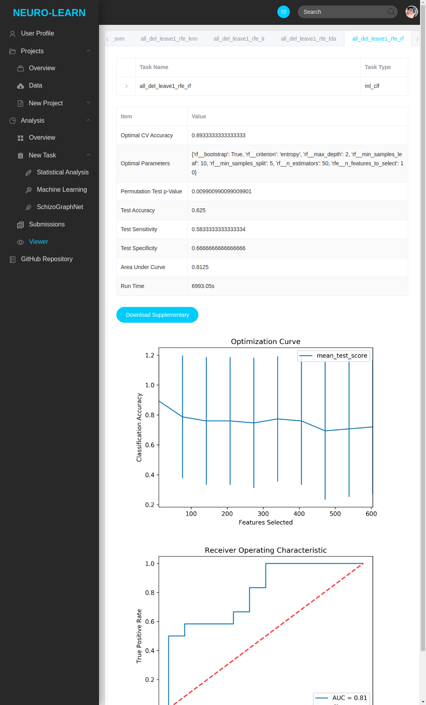
