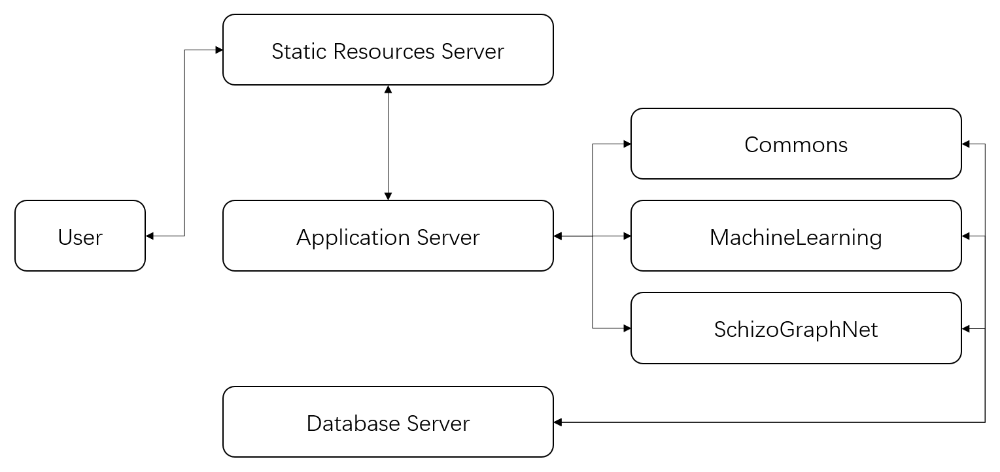

# NEURO-LEARN-DOCKER

## Quick Start

```bash
# Open a terminal on the host, change directory to utils
user@machine:~$ docker-compose -f docker-compose.yml up -d
user@machine:~$ ifconfig
...
inet 192.168.51.148  netmask 255.255.255.0  broadcast 192.168.51.255
...
# open a browser on another machine under the same LAN with the host and type the address '192.168.51.148'.
# VOILA!
```

## NEURO-LEARN-DOCKER Layout



## More

- More information about NEURO-LEARN-DOCKER can be found in [NLD Documentation](https://github.com/Raniac/NEURO-LEARN-DOCKER/wiki).
- 中文文档请戳[这里](https://www.jianshu.com/p/067747c881ee)。
